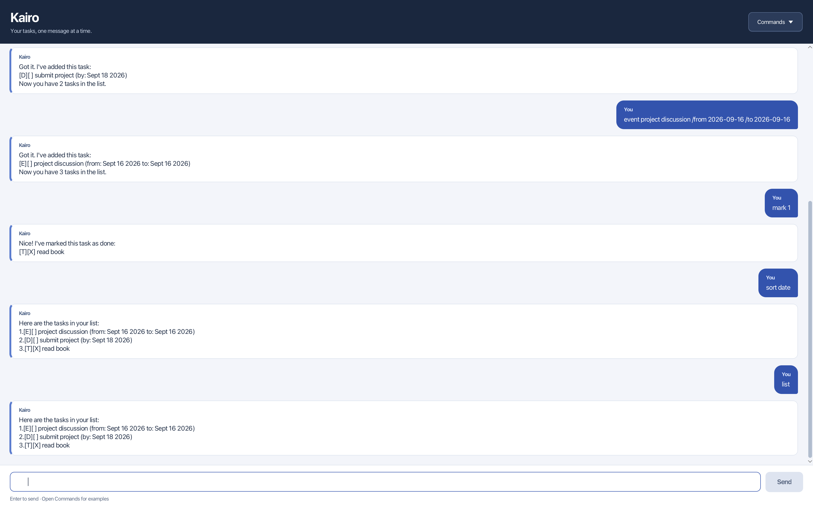

# Kairo User Guide

Kairo helps you manage todos, deadlines, and events through a chat window.
Add tasks, track completion, find what you need, and sort your list. Successful
changes are saved automatically for your next session.

[Download Kairo](https://github.com/tiannnle/ip/releases) ·
[View the source](https://github.com/tiannnle/ip)



## Quick start

1. Install **Java 25**. You can obtain a Java 25 JDK from
   [Azul Zulu](https://www.azul.com/downloads/).
2. Download `kairo.jar` from the [Releases page](https://github.com/tiannnle/ip/releases)
   and place it in a folder where you want to keep Kairo and its tasks.
3. Open a terminal in that folder and run:

   ```bash
   java -jar kairo.jar
   ```

4. Type a command in Kairo's input box and press **Enter** or select **Send**.
   The **Commands** menu fills the input with an example that you can edit before sending.

In a new task list, try these commands one at a time:

```text
todo read book
list
mark 1
```

Always launch Kairo from the same folder so it can find the same saved tasks.

## Understanding your task list

Enter `list` to see your tasks. An example list looks like this:

```text
Here are the tasks in your list:
1.[T][X] read book
2.[D][ ] submit project (by: Sep 18 2026)
3.[E][ ] project discussion (from: Sep 16 2026 to: Sep 16 2026)
```

- `[T]` means todo, `[D]` means deadline, and `[E]` means event.
- `[X]` means completed; `[ ]` means incomplete. Completed tasks stay in the list.
- The number before a task is its current position in the full list.

**Use the current numbers shown by `list` or `sort` for `mark`, `unmark`, and `delete`.**
Sorting and deletion can change these numbers. Search results have their own numbering;
run `list` after a search to get the task number to edit.

## Command reference

Replace uppercase placeholders such as `DESCRIPTION` and `NUMBER` with your own values.
Enter the command words themselves in lowercase.

| Action | Command | Result |
| --- | --- | --- |
| View all tasks | `list` | Shows the full numbered task list. |
| Add a todo | `todo DESCRIPTION` | Adds a task without a date. |
| Add a deadline | `deadline DESCRIPTION /by DATE` | Adds a task with a due date. |
| Add an event | `event DESCRIPTION /from START /to END` | Adds an event with start and end dates. |
| Mark completed | `mark NUMBER` | Marks the task as completed. |
| Mark incomplete | `unmark NUMBER` | Marks the task as incomplete. |
| Delete a task | `delete NUMBER` | Removes the task and saves the remaining list. |
| Find tasks | `find KEYWORD` | Finds descriptions containing the keyword or phrase. |
| Sort alphabetically | `sort name` | Orders tasks by description, ignoring capitalization. |
| Sort chronologically | `sort date` | Orders dated tasks from earliest to latest, with todos last. |
| Exit | `bye` | Shows a farewell and closes the window. |

## Adding tasks

Use a **todo** for something without a date:

```text
todo read book
```

Use a **deadline** for something due on a date:

```text
deadline submit project /by 2026-09-18
```

Use an **event** for something taking place between two dates:

```text
event project discussion /from 2026-09-16 /to 2026-09-16
```

Dates use **`yyyy-MM-dd`**, such as `2026-09-18`. Times of day are not supported.
An event can start and end on the same day, but its end cannot be before its start.
Kairo confirms each addition and shows the new task count. Duplicate tasks are allowed.

## Completing and deleting tasks

After checking the numbers with `list`, use:

```text
mark 1
unmark 1
delete 1
```

`mark` and `unmark` change completion status. `delete` removes the task immediately;
there is no undo command. Check the latest task number before deleting.

## Finding tasks

```text
find book
```

This finds descriptions containing `book`, including `Read Book` and `buy notebook`.
Matching ignores capitalization. A multiword keyword, such as `find read book`,
matches that consecutive phrase. Searching leaves the full list unchanged.

If nothing matches, Kairo replies:

```text
No matching tasks found.
```

Search-result numbers start at 1 and may differ from the full-list numbers.
Use `list` before marking, unmarking, or deleting a search result.

## Sorting tasks

```text
sort name
sort date
```

- `sort name` sorts by description without distinguishing uppercase and lowercase.
- `sort date` uses a deadline's due date or an event's **start** date. Todos appear last.
- Tasks with equal names or dates keep their relative order. Both completed and incomplete tasks are included.

The new order is displayed and saved for your next session. New tasks are still added
at the end; run a sort command again whenever you want to reorder them.

## Input rules and corrections

- Descriptions and search keywords must not be empty.
- Task numbers are positive whole numbers that exist in the current full list.
- Spaces or tabs can separate date markers and values. Each deadline needs one `/by`;
  each event needs one `/from` followed by one `/to`. Repeated markers are rejected.
- Standalone `/by`, `/from`, and `/to` are reserved markers in deadline and event commands.
- New descriptions cannot contain the pipe character (`|`) or line breaks.
- Extra spaces at the start or end of a command are ignored. Spaces inside descriptions are preserved.
- `list` and `bye` take no extra arguments. Sorting accepts exactly `sort name` or `sort date`.

Errors appear in a red card labeled **Kairo · Error**. The failed command stays in the
input box so you can correct it and try again. For example, `bye now` shows an error
and keeps Kairo open; replace it with `bye` to exit. Send is disabled for blank input.

## Saved tasks and troubleshooting

Kairo saves successful additions, completion changes, deletions, and sorting to
`data/kairo.txt`, relative to the folder you launched it from. A missing data folder
or file is created on the first successful task change. No separate save command is needed.

To move Kairo, close it and copy both `kairo.jar` and its `data` folder to the new location.
Launch it from that new folder. To keep a backup, copy `data/kairo.txt` while Kairo is closed.

| Problem | What to do |
| --- | --- |
| Java reports that the JAR was compiled by a newer version. | Run `java -version` in the terminal and switch to Java 25. |
| My saved tasks seem to be missing. | Check that you launched Kairo from the folder containing your original `data` folder. |
| A command shows a format or date error. | Correct the retained input using the command reference and a real date in `yyyy-MM-dd` format. |
| Kairo could not save the tasks. | Check that the launch folder is writable and `data/kairo.txt` is a file. Try a writable local folder. The failed change is not applied; retry after fixing the problem. |
| Kairo could not load the tasks. | Close Kairo and back up the task file. Restore a working backup or correct the invalid record identified in the error, then restart. Task commands are blocked for that session to protect the saved file. |

Use [the project repository](https://github.com/tiannnle/ip) to view the source or report a problem.
